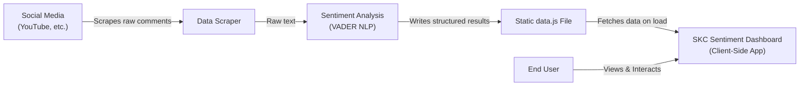

# skc-sentiment-dashboard

## High-Level Architecture

The **SKC Sentiment Dashboard** is a real-time dashboard that visualizes how Sporting KC fans are feeling based on social media comments. Here's how it's structured:

### The Big Picture

The system is split into two distinct parts:

1. **Offline Data Processing (Upstream):** A separate process that scrapes comments from platforms like YouTube, runs sentiment analysis on them, and packages the results into a data file.

2. **Online Visualization (This Repo):** A purely client-side web application that fetches the pre-analyzed data and displays it interactively in the browser.

This separation is intentional—it keeps the dashboard fast and responsive because the browser only needs to render results, not perform complex natural language processing.

### Key Components

**Frontend (SKC Sentiment Dashboard)**
- Built with HTML5, CSS3, and vanilla JavaScript
- Uses **Chart.js** for data visualization (donut and bar charts)
- Renders interactive charts, key metrics, and a filterable comment feed
- Designed to be accessible to non-technical users (marketing team, front office, etc.)

**Sentiment Analysis Service (Upstream)**
- Uses **VADER NLP** (Valence Aware Dictionary and sEntiment Reasoner) to analyze sentiment
- Categorizes each comment as positive, negative, or neutral
- Assigns a numerical sentiment score (-1.0 to +1.0)
- Runs offline on a schedule (e.g., nightly)

**Data Layer**
- Currently uses a static **`data.js` file** that contains all analyzed comments and metadata
- The upstream process generates this file after analysis completes
- Served alongside the HTML/CSS/JS files
- Can be hosted on any static web host (GitHub Pages, Netlify, etc.)

### Data Flow

```
Fan Posts Comment → Offline Scraping → Sentiment Analysis → data.js Generated 
→ User Opens Dashboard → Browser Fetches data.js → Client-Side Rendering 
→ Charts & Metrics Displayed
```

### Architecture Diagram



### Why This Architecture?

**Pros of the Static API Pattern:**
- Blazing fast—no network latency waiting for API responses
- Simple and cheap—can be hosted on free static hosting
- Zero backend maintenance—no server, database, or dependencies to manage

**Cons:**
- Data isn't live—only as fresh as the last time `data.js` was generated
- Limited scalability—large datasets would require users to download massive files

For the current scale and use case, this approach is ideal. As the system grows, it will likely evolve into a true REST API that supports dynamic filtering and pagination.
